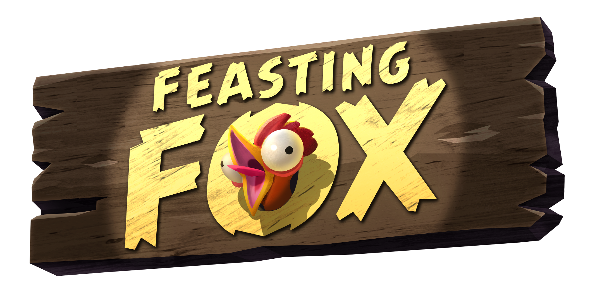
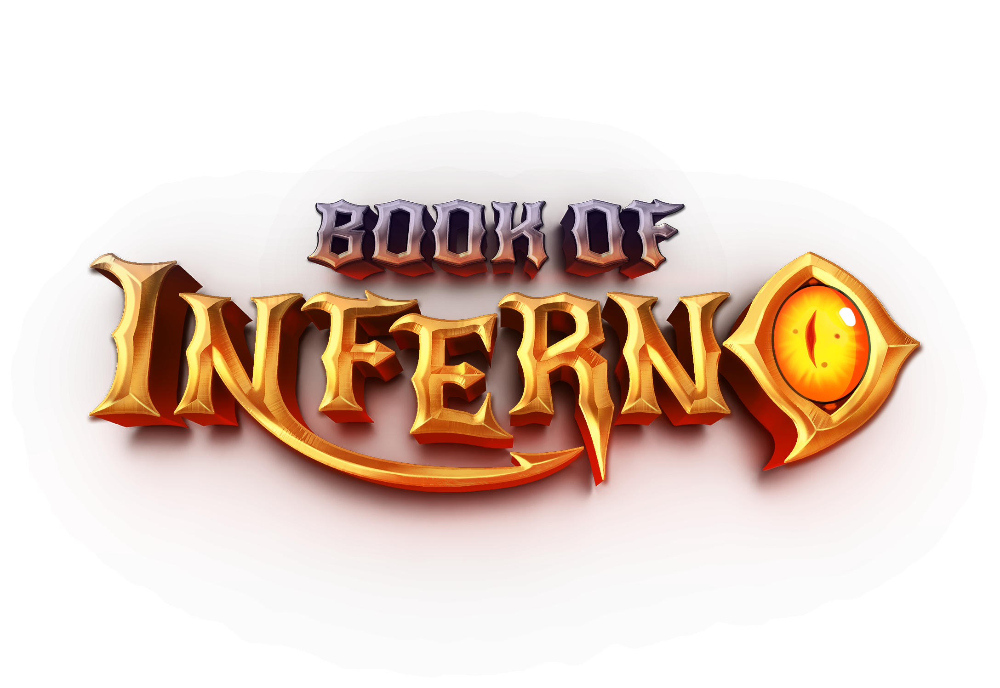
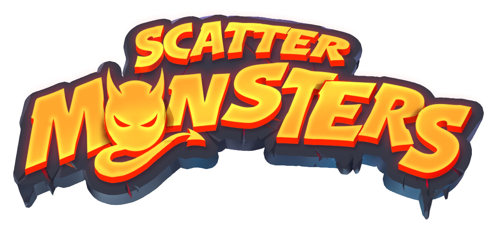
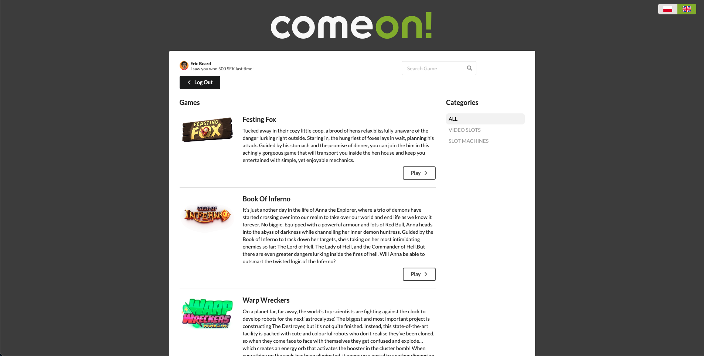

# Project title  📛
Comeon casino app

## Technologies ☕️ ⚛️
- React
- Type Script
- Tailwind
- semantic-ui
- React router
- i18next for translations
- app setup with vite

## Setup  💻
1. Install all dependencies
```
npm install
```

2. to run application
```
npm run dev
```

3. to run server with mock api
```
npm run server
```

## About the app  📚
Comeon casino app allows you to play several games:

### Festing Fox


### Book Of Inferno


### Warp Wreckers


### Reno 7's


### Scatter Monsters


## Screenshots  📷


  Picture by <ins>Marcin Cholewka</ins>


